# github-releases-for-automated-package-publishing-action

> GitHub Action to validate and extract GitHub release information, used for automated package publishing.

There are several ways to do automated releases and package publishing via GitHub actions, but many of them have drawbacks, at least in my opinion.

-   Many other GitHub Actions and [manually running a workflow](https://docs.github.com/en/actions/managing-workflow-runs/manually-running-a-workflow) only allow publishing from the default branch (ie. `master` or `main`).
-   Other guides and GitHub Actions allow for publishing on any branch by looking for changes to the `version` in `package.json` on the `push` event, but this lacks protection from just anyone opening a PR and publishing a new version.
-   [GitHub's publishing node packages guide](https://docs.github.com/en/actions/guides/publishing-nodejs-packages) doesn't enforce keeping `version` in `package.json` synchronized with the GitHub release.
-   True pre-releases, with npm tags (ie. `package@beta`, `package@canary`, etc.) aren't supported.

This GitHub Action was created to overcome these limitations and gaps. This action, paired with the `release` GitHub Action event, will:

-   Ensure release drafts won't cause a package to be published.
-   Ensure git tags start with a `v`, like `npm version` and `yarn version`.
-   Ensure that the `version` in `package.json` matches the release being created.
-   Ensure versions are valid [semver](https://semver.org/) format.
-   Ensure the GitHub release is marked as a pre-release if the semver version has a pre-release tag.
-   Allow only users with write permissions to create releases.
-   Allow packages to be published from any branch, which is great for publishing pre-releases before code is merged into the default branch.
-   Allow full control on how to publish, without assuming anything, like yarn vs. npm, NPM registry vs. GitHub Packages registry, running additional validation or build steps prior to publishing, etc.

## Usage

### Generate a Package Registry Token

Whether you're using [NPM](https://www.npmjs.com/) or [GitHub Packages](https://github.com/features/packages) as your package registry, you'll need to generate a token that will allow automated publishing of your package. This token will be used in your GitHub Actions workflow, as we'll see later below.

> **_Note_**: These tokens should be treated with care. If exposed or compromised, they can be used maliciously as they have the power to publish code on your behalf. Never commit them to your repository or share them with others.

<details>
  <summary>How to Generate an NPM Token</summary>

You'll need to generate a new token in your NPM account, which will allow automated publishing of packages.

The screenshots below will visually walk you through the process.


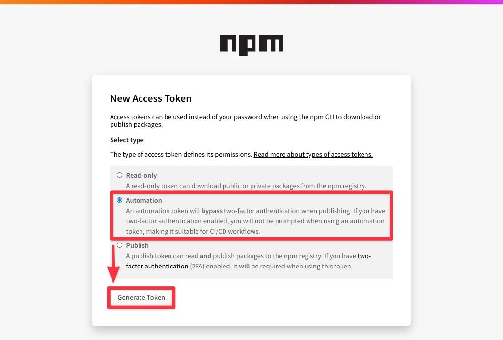
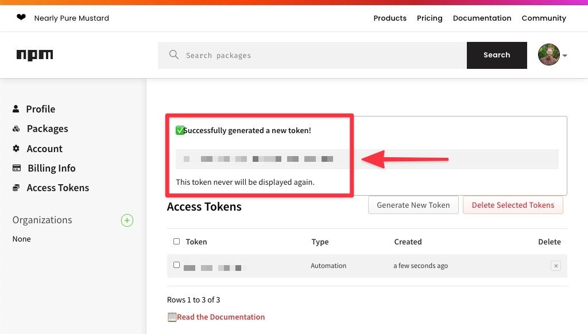

</details>

<details>
  <summary>How to Generate a GitHub Token</summary>

You'll need to generate a new token in your GitHub account, which will allow automated publishing of packages.

The screenshots below will visually walk you through the process.


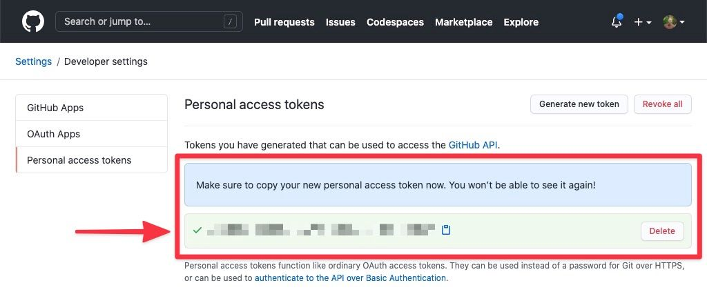

</details>

### Add Package Registry Token to GitHub Secrets

Once you have a registry token, you need to add that token to GitHub so it can be used in GitHub Action workflows. This can be done one of two ways, either on a repository (only option available for personal accounts, which unfortunately means you'll need to do this for each repository you want to automate releases / publishing for) or as a shared secret for an entire GitHub organization.

You would use either `NPM_TOKEN` or `GITHUB_TOKEN` for the secret name, depending on what package registry you're using.

<details>
  <summary>How to Add Secrets to a Repository</summary>

Since your token is sensitive information, you'll need to store it in GitHub as a secret. Individual accounts will need to add secrets to each repository.

The screenshots below will visually walk you through the process.


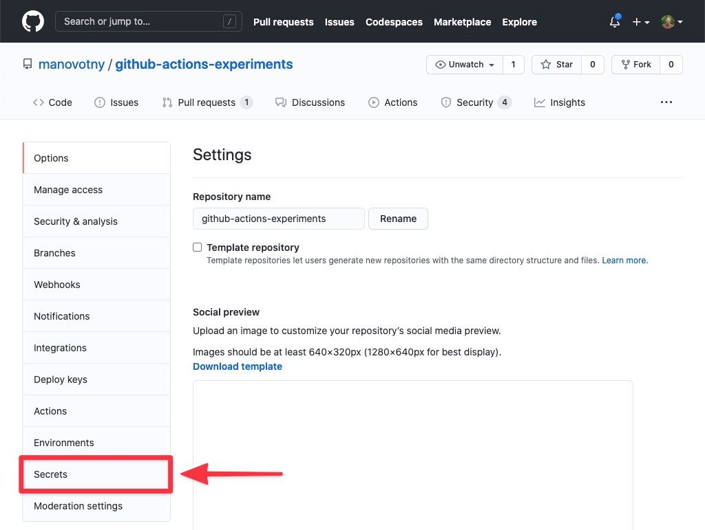
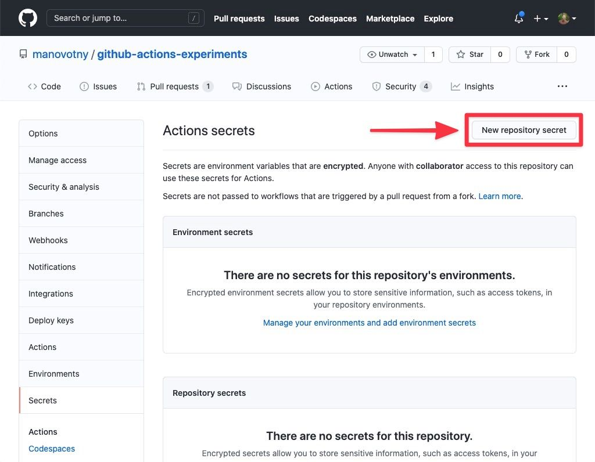
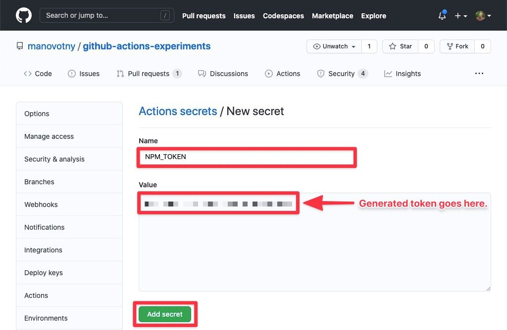
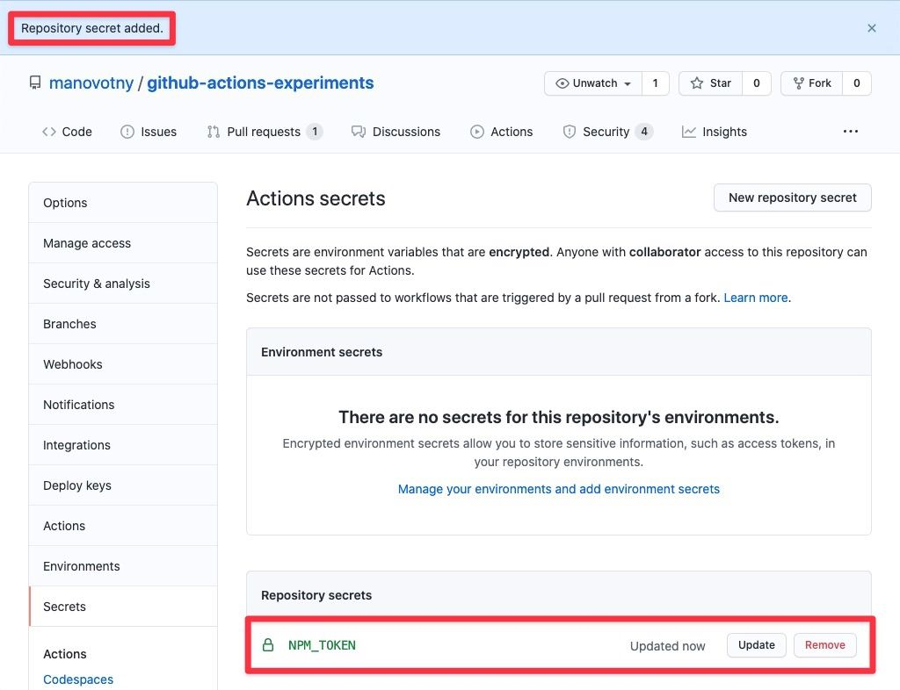

</details>

<details>
  <summary>How to Add Secrets to a GitHub Organization</summary>

Since your token is sensitive information, you'll need to store it in GitHub as a secret. Organizations can store secrets at the organization level, meaning it will be accessible to all repositories within the organization.

The screenshots below will visually walk you through the process.


</details>

### Add a GitHub Action Workflow for Automated Publishing of Packages

`github-releases-for-automated-package-publishing-action` will output the following properties, which you can use in your GitHub Action workflow.

#### version

> string

The version of the package to publish.

Examples: `1.2.3`, `1.2.3-beta.1`

#### tag

> string

Extracted tag of a version.

For example, a version of `1.2.3-beta.1` would extract `beta` for the tag.

Package dependencies can be installed using version tags, such that `<package>@<tag>` will install the latest version with that tag. This is typically done for pre-releases or early access releases.

Read [npm-dist-tag](https://docs.npmjs.com/cli/v6/commands/npm-dist-tag) for more information on version tags and how to use them.

Default: `''` (empty string)

Examples: `beta`, `canary`

#### Example

Below is an example of a GitHub Actions workflow.

As you can see, we look for the `release` event, specifically, the `created` release type.

The code below is just an example. You can leverage `github-releases-for-automated-package-publishing-action` output for publishing however you want.

```yaml
name: release
on:
    release:
        types: [created]
jobs:
    release:
        runs-on: ubuntu-latest
        steps:
            # Checkout the exact commit tagged on the release.
            - name: Checkout repo
              uses: actions/checkout@v2
              with:
                  ref: ${{ github.event.release.target_commitish }}

            # This is the action in this repo! 👇
            # Note we set an `id` called `release`. We'll use that later...
            - name: Validate and extract release information
              id: release
              uses: manovotny/github-releases-for-automated-package-publishing-action@v1.0.0

            # When setting the node version for publishing a release, it's also impotant
            # to set `always-auth` and `registry-url` too. I've encountered vauge errors
            # and publishing doesn't work unless they are supplied.
            #
            # This example is using NPM's registry. If you were publishing to GitHub's
            # Package registry, you'd use `https://npm.pkg.github.com` instead.
            - name: Set node version
              uses: actions/setup-node@v2
              with:
                  always-auth: true
                  node-version: '12.x'
                  registry-url: 'https://registry.npmjs.org'

            # Perform installs, run tests, run a build step, etc. here, as needed.

            # The last two steps will publish the package. Note that we're using
            # information from the `release` step above (I told you we'd use it
            # later). Notice the `if` statements on both steps...
            #
            # If there *is* a tag (ie. `beta`, `canary`, etc.), we publish a
            # "pre-release" or "tagged" version of a package (ie. 1.2.3-beta.1).
            #
            # If there *is not* a tag (ie. `beta`, `canary`, etc.), we publish a
            # version of a package (ie. 1.2.3).
            #
            # This example is using npm to publish, but you could just as easily
            # use yarn, if you prefer. It's also publishing to the NPM registry,
            # thus, it's using `NPM_TOKEN`, but you could just as easily use
            # `GITHUB_TOKEN` if you were publishing to the GitHub Package registry.

            # This will publish a "pre-release" or "tagged" version of a package.

            # This will publish a version of a package.
            - name: Publish version
              if: steps.release.outputs.tag == ''
              run: npm publish
              env:
                  NODE_AUTH_TOKEN: ${{ secrets.NPM_TOKEN }}

            - name: Publish tagged version
              if: steps.release.outputs.tag != ''
              run: npm publish --tag ${{ steps.release.outputs.tag }}
              env:
                  NODE_AUTH_TOKEN: ${{ secrets.NPM_TOKEN }}
```

### Create a Release to Publish a Package

With all of the above in place, publishing a package is as easy as creating a new release on the repository.


When making a release, please keep in mind that this action expects and validates a few things:

-   Releases marked as drafts will be ignored (ie. they will not publish).
-   Ensure the git tag you create during the release process starts with a `v` (ie. v1.2.3).
-   Ensure that the `version` in `package.json` matches the release tag created.
-   Ensure versions are valid [semver](https://semver.org/) format.
-   Ensure the GitHub release is marked as a pre-release if the semver version has a pre-release tag.

Now you need to decide what kind of release you want to make.

<details>
  <summary>How to Publish a Version</summary>

Creating a new GitHub release will start the automated publishing process.

The screenshots below will visually walk you through the process.

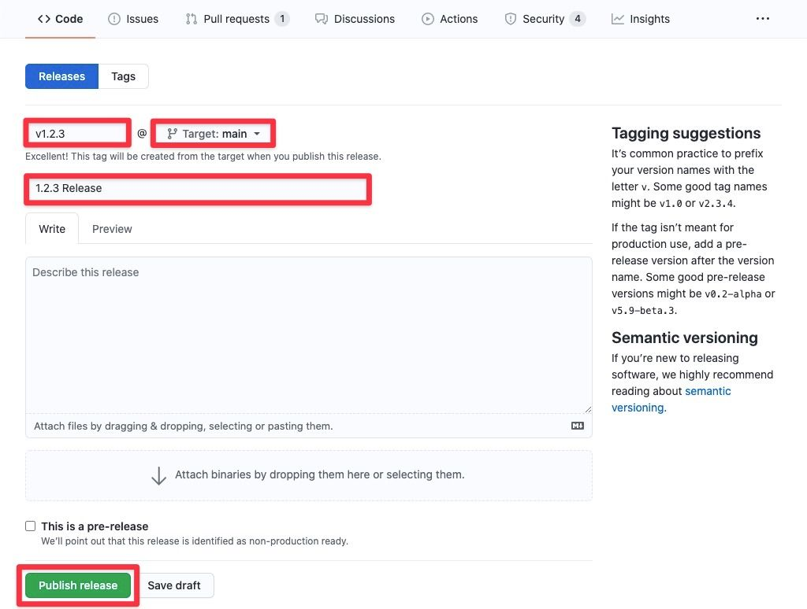


</details>

<details>
  <summary>How to Publish Pre-Release / Tagged Version</summary>

Creating a new GitHub release will start the automated publishing process. To create a pre-release / tagged version, you'll need to use the proper pre-release / tagged semver syntax and mark the release as a pre-release.

The screenshots below will visually walk you through the process.

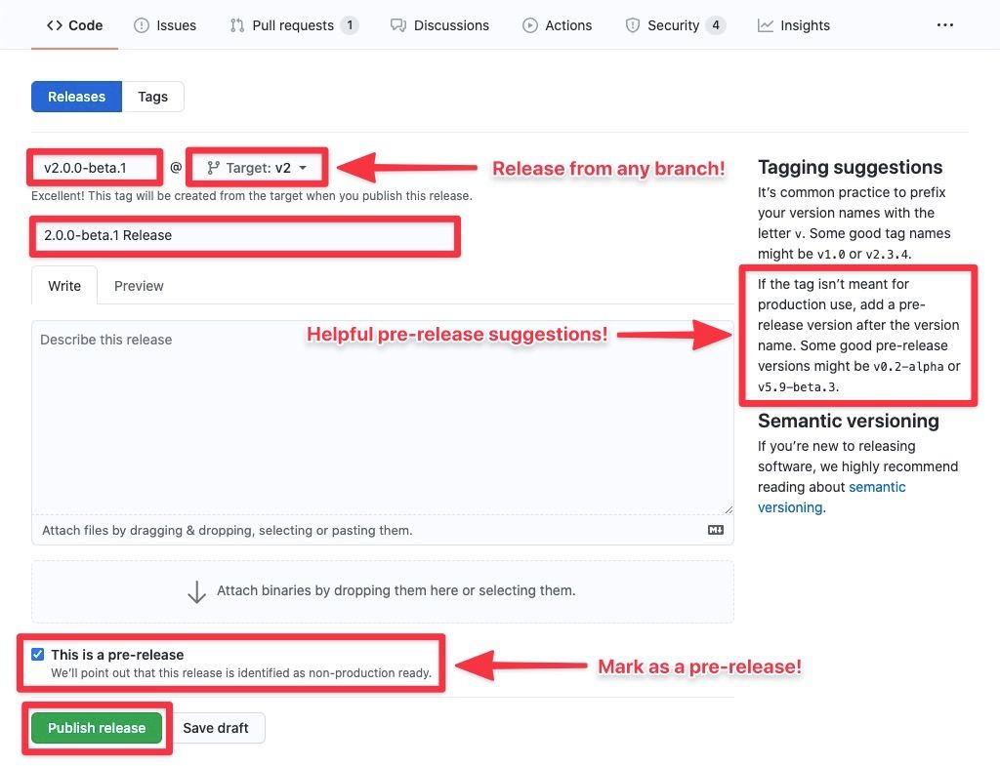
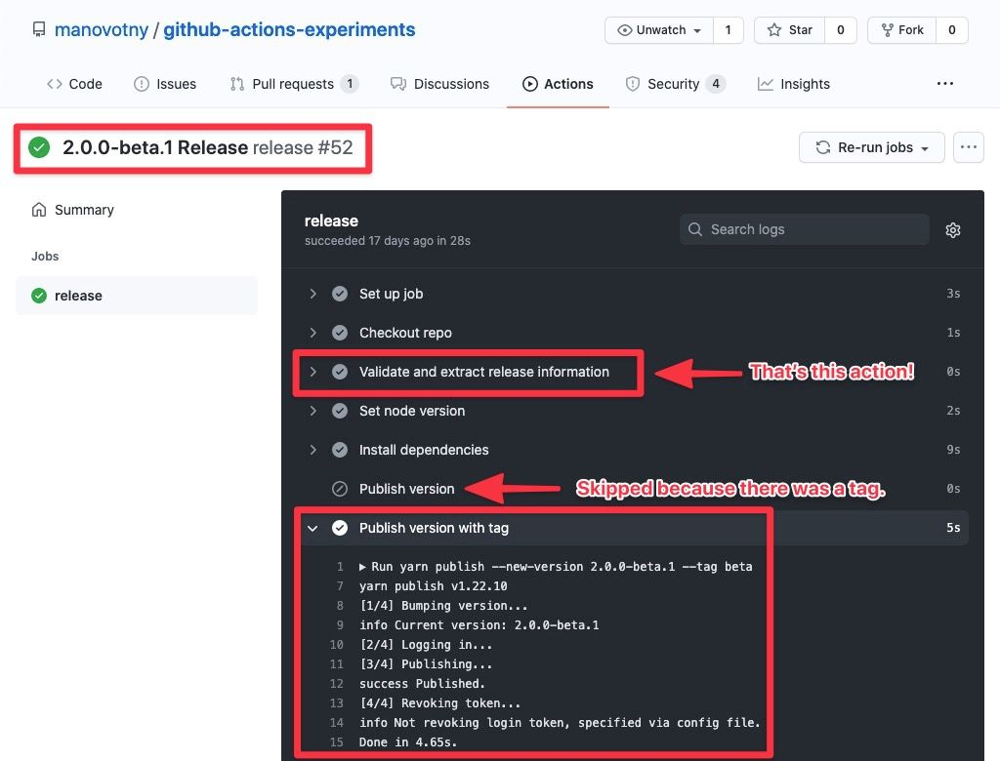

</details>

## Troubleshooting

<details>
  <summary>How to Handle Release Failures</summary>

In the event a publish fails for a release due to validation issues or for some other reason, rolling back the release is relatively easy.

1. Delete the corresponding release and tag from GitHub.
1. Address the underlying issues that cause the failure.
1. Try creating a release again.

The screenshots below will visually walk you through the process.

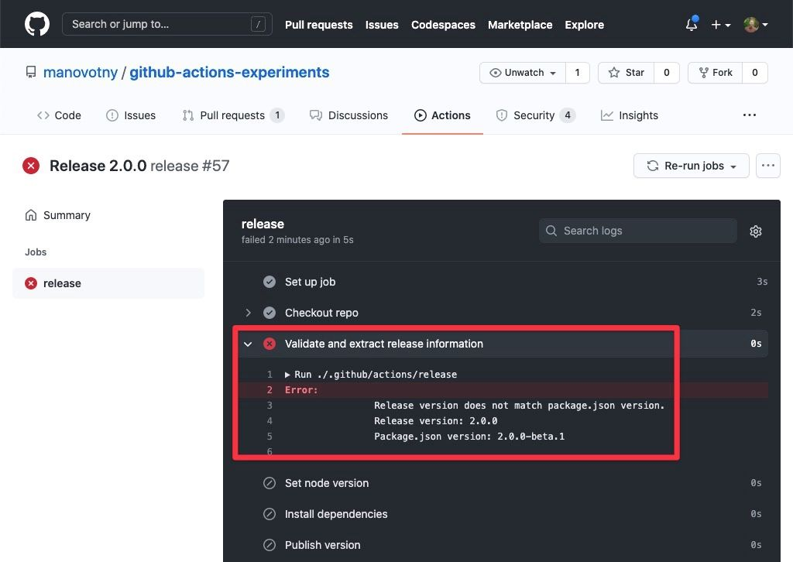

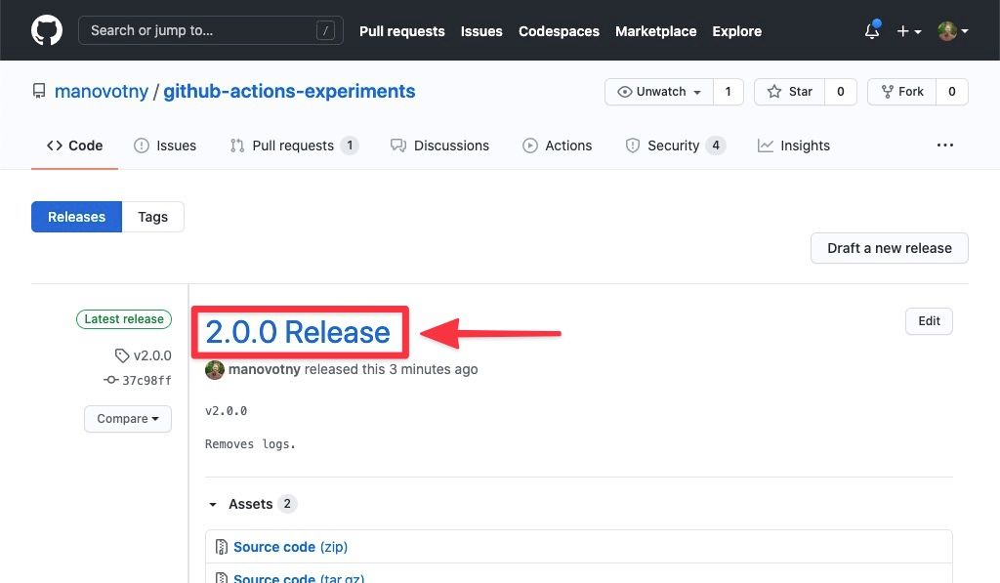

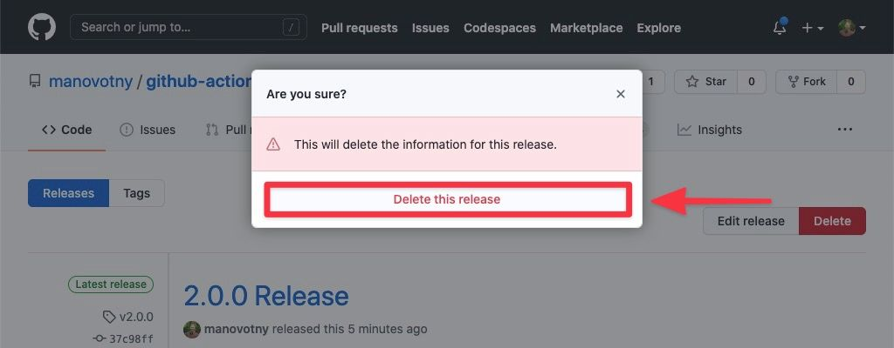


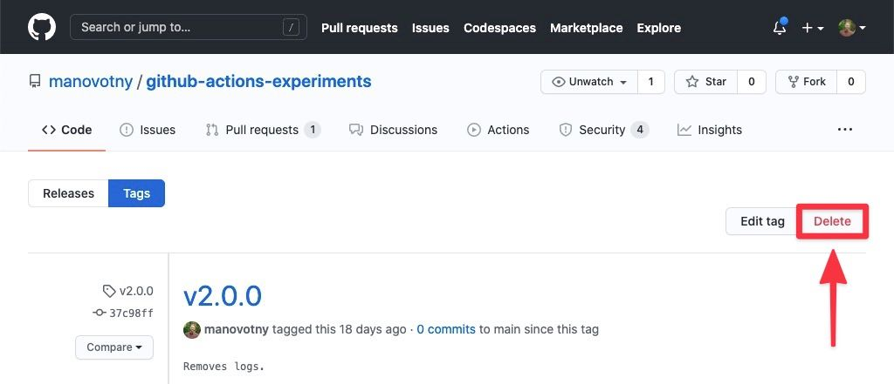
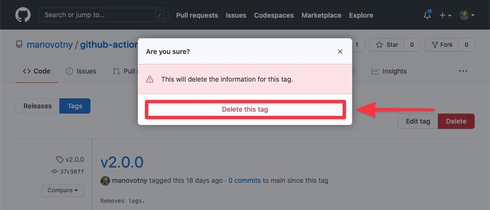


</details>

<details>
  <summary>Fixing "No Token Found" Error Message When Publishing</summary>

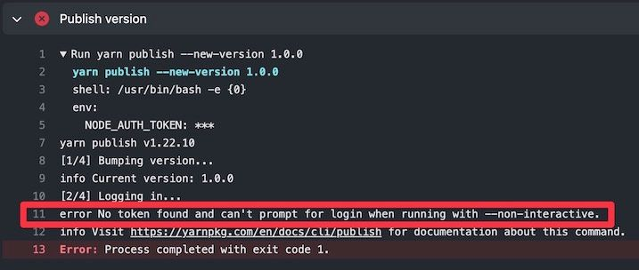

First thing to check is that you've [added a package registry token to your GitHub secrets](https://github.com/manovotny/github-releases-for-automated-package-publishing-action#add-package-registry-token-to-github-secrets).

If you're still getting the error, then it's because you likely forgot to add the `always-auth` and `registry-url` properties when setting the node version in your workflow.

```yml
- name: Set node version
  uses: actions/setup-node@v2
  with:
      always-auth: true
      node-version: '12'
      registry-url: 'https://registry.npmjs.org'
```

</details>

## Related

Be sure and check out my [github-actions-experiments](https://github.com/manovotny/github-actions-experiments) repo where I mess around with other concepts to enhance your GitHub Actions workflows and experience!

## License

MIT © [Michael Novotny](http://manovotny.com)
